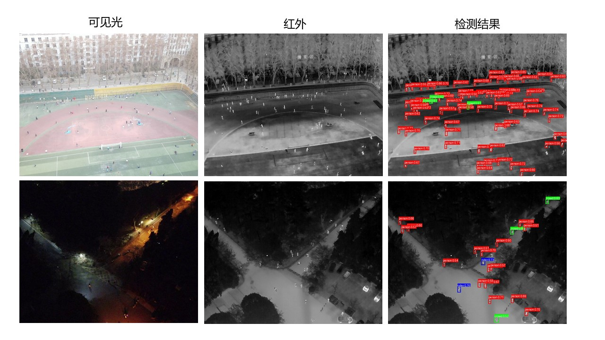

  

# 多线程Socket通信的双模态小目标检测传输

本项目基于TCP Socket实现多线程通信，专注于双模态（可见光+红外）小目标检测的图像传输与处理，具体介绍如下：

## 1. 客户端多线程发送双模态图像
- 客户端通过多线程分别处理可见光和红外图像发送。
- 图像数据按指定格式（含类型、文件名、大小等头部信息）通过TCP连接传输至服务端。
- 同时维护心跳机制（定期发送`HEARTBEAT`），确保与服务端的连接稳定性。

## 2. 服务端多线程接收与推理处理
- 服务端启动主线程监听端口，每接收到客户端连接即创建独立子线程处理交互。
- 子线程解析图像数据，按类型（可见光/红外）分类存储，并校验数据完整性。
- 当一对双模态图像接收完成后，调用训练好的模型进行小目标检测推理。

## 3. 检测结果回传与展示
- 服务端将推理生成的结果图像按协议格式发送回客户端。
- 客户端接收结果后，可实时展示或存储检测后的双模态图像。

## 用法

1. **部署服务端代码**：
   - 配置服务端IP、端口及模型路径等参数。
   - 将服务端代码部署至服务器，确保双模态小目标检测模型环境就绪。

2. **部署客户端代码**：
   - 配置客户端连接的服务端地址及图像采集参数。
   - 在客户端设备部署代码，准备双模态图像源。

3. **运行代码并检测通信**：
   - 先启动服务端，确认监听成功（显示“等待客户端连接...”）。
   - 运行客户端，验证连接建立（服务端返回`ACCEPTED`）。
   - 客户端发送双模态图像，服务端自动处理并返回检测结果。

4. **中断通信并关闭**：
   - 检测结束后，客户端可发送终止指令，或直接关闭程序中断连接。
   - 服务端自动清理线程资源，保持对其他客户端的监听。
